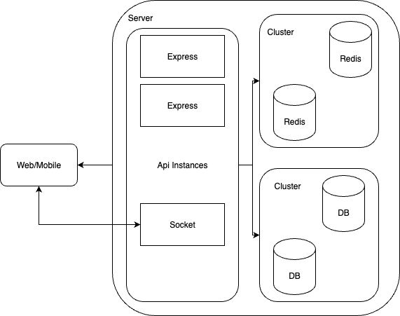
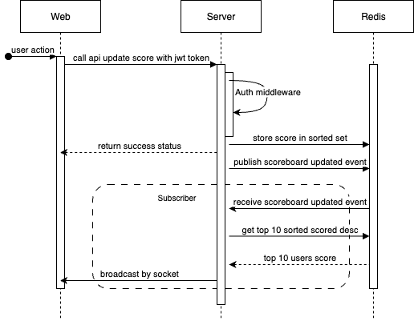

# Live Scoreboard Design

This is the design of a live scoreboard service inlcuding broadcasting leaderboard to all users, update user score, store user record in the database.

## Overall architecture

### Components

- `web/mobile`: your client side application for user to interact.
- `express`: handle api request from sent from the client.
- `socket`: handle real time communication with the client.
- `redis`: store user scores, pub sub updated user scores event.
- `database`: store user score record

## Sequence diagram

Step by step diagram shows how user scores can be stored, sorted and broadcasted through out the app.

### Explaination

- 1. Client send a update score quest to the server with token (generated after login) attached to request header.
- 2. The request go through authentication middleware (decode and verify token data).
- 3. Increase user score to the `scoreboard` identified by their ids.
- 4. Early response to the client so the app doesn't need to wait.
- 5. Send a `score updated` event to redis.
- 6. A subcriber received `score updated` published previously.
- 7. Subcriber fetch sorted scores from the `scoreboard`
- 8. Broadcast the scores list to users

### With this approach:
- users' api request can be returned as soon as possible reduce the loading time on the client side.
- quickly read and write to the `scoreboard` since it is stored on `redis`.
- logics are decoupled and easy to maintain and scale.
- handle multiple games at the same time by making different set for each games.

### Potental add ons:
- sending users' scores with `score updated` event so the subcriber can store it on the database for logging, tracing purpose.
- in case of time limit game: add a delay job queue (using `bull` or custom made with `redis`). When triggered, clear the `scoreboard` for that game, save the last result to database for later uses.
